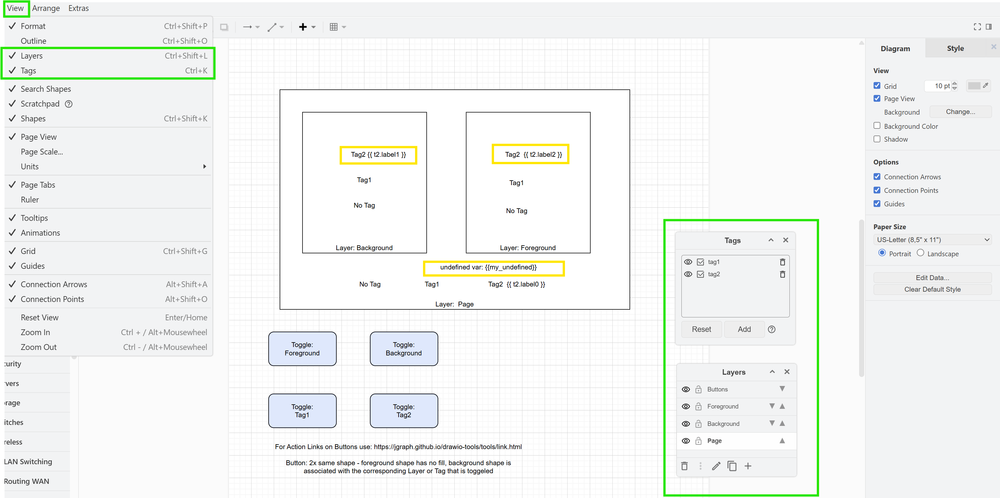
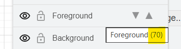

# dynamic-drawio-jinja2-example

> Live Version here: [gh pages dynamic-drawio-jinja2-example](https://lumean.github.io/dynamic-drawio-jinja2-example/)

This is an example of how to use jinja2 templating in draw.io diagrams as a poor man's / low-code alternative to
dynamically generating the svg/xml in as code. It is especially useful when people without
deep programming skills need to maintain/update the diagrams.


It can be useful to dynamically create visual docuementation where different parameters are injected into the diagrams.
For exapmle - have your infra as code parameters in yaml in the repo and then use a CI/CD pipeline / Github actions
to generate static pages (e.g. with mkdocs / mkdocs-drawio) to render nice documentation diagrams with the actual values.

Install the [Henning Dieterichs Draw.io extension](https://marketplace.visualstudio.com/items?itemName=hediet.vscode-drawio) in VS Code.

Add the following to your settings.json if you want to use the j2 extension for drawio files with jinja2 templating:
```json
{
  "workbench.editorAssociations": {
    "*.drawio.j2": "hediet.vscode-drawio-text",
  }
}

```

To replace arbitrary variables in your drawio diagrams, you can use jinja2 templating syntax just in normal text lables.

Enable Tags and Layers in the diagram editor settings:



To change which part of the diagram is visible by default, you can use xml / xpath to set the visible layers/tags.
For tags you can use the names, for layers you need the layer ids, which will be shown when you hover over the layer name in the layers panel.




## Limitations

If you want to dynamically add shapes at different positions, it is not straightforward to do with the visual editor.

Multiple possibilites:
- You pre-draw the nubmer of shapes you want but make them hidden by using different tags.
  then you can use the modify xml function in the exampele python script to unhide the corresponding tags in the loop.
- Alternatively, you could create an initial diagaram with the singel shape and then apply jinja as raw modifications to the underlying XML structure of the drawio file.
  This however, most likely results in an invalid xml structure so you cannot open the file in the visual editor anymore.
- You could wrap your jinja control characters in CDATA/comment sections to avoid XML parsing issues, however
  this might get overwritten the next time someone opens the file in the visual editor and saves it again.

Let me know in the issues if you have other ideas to solve this use case.


#

local testing run a local mkdocs server (by default reads ./docs folder)
```
mkdocs serve
```

Build static site for gh pages to ./site folder
```
mkdocs build
```